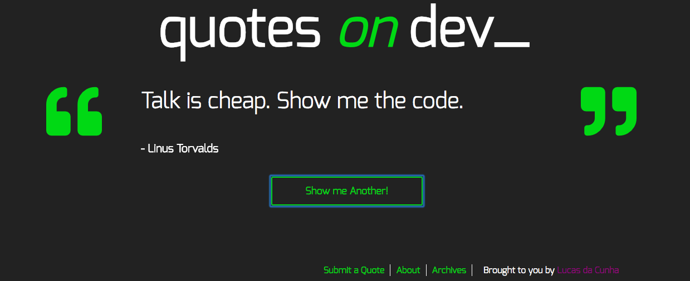
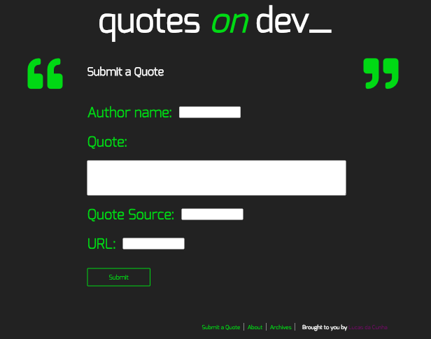

# Quotes on Dev
The website is built with Wordpress, MySql, PHP, SCSS, CSS, HTML, Gulp and Javascript (Jquery).

# Loops
The website is responsive to changes on the MySql database updates. The loops used on the shop, journal and blogpost tags will automatically catch updates made and fetch them to the page. Multiple loops have been used for specific porpuses.

# Ajax
This website is built using ajax with hashing to deal with inputs to the database from the users. A logged in user can add new quotes to the website and it will be sent to the database on pending status. See form for ajax interaction.

# Fonts
This project is done by downoloading the founts we are using from google founts and appending it to the project using font-face.

# Structure main files:
    index.html
    style.min.css - min file of multiple sass archives
    main.min.js - min file of main.js
    enqueu.php - file enqueuing important scripts.
    loop-jornal - File controling the loops on the page. Imported on specific php files to use the loop.

# License
This project is licensed under the MIT License
